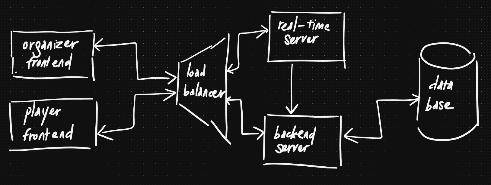
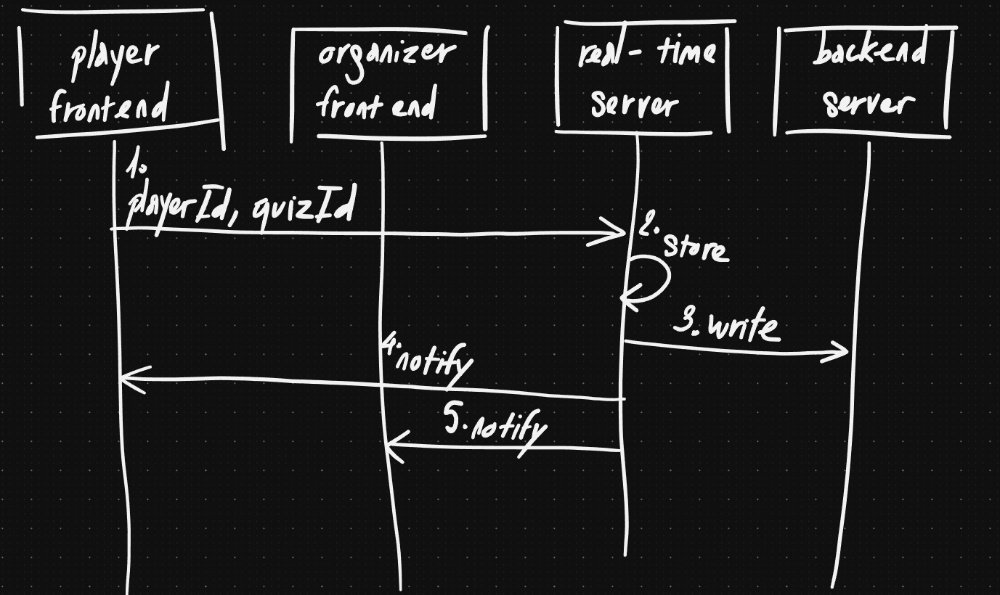
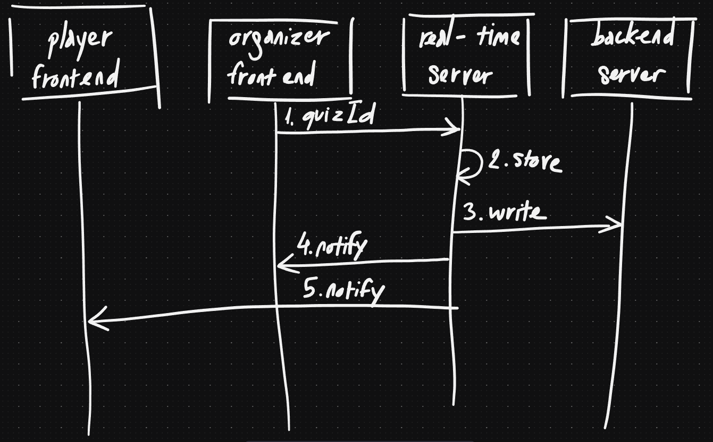
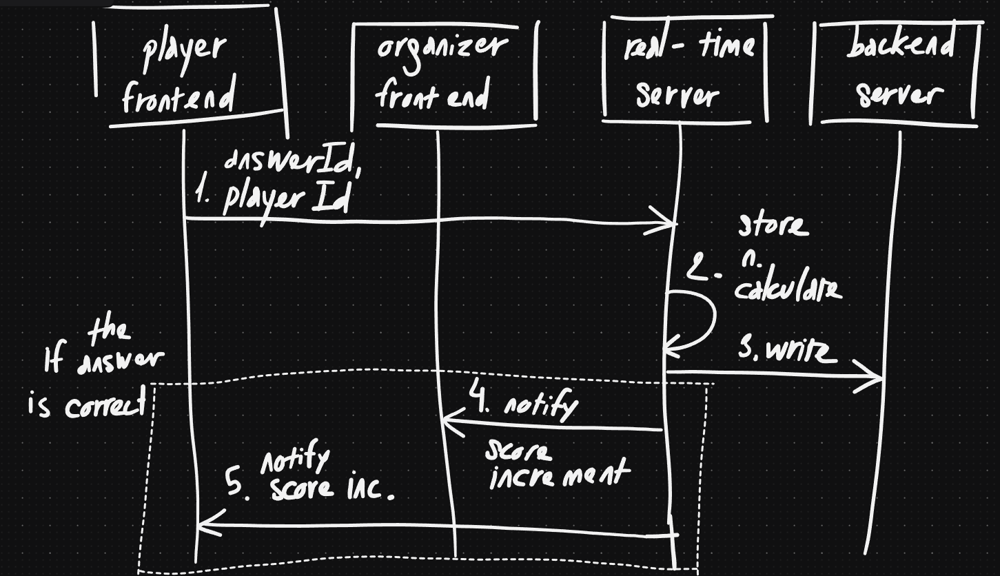

# System Design

The original requirements for the system can be found in the 
[original requirements document](./original_requirements.md). After thinking
about the requirements for a while, I realized that it is quite similar to what 
Kahoot's doing, so I drafted the UI with the same flow:

- There are two types of users: the organizer and the player
- The players will be able to join a game
- There will be multiple rounds of quizzes
- After each round, everyone will be able to see the results/leaderboard
- The organizer will be the one who controls the game (start the game or 
  complete the quizzes early)

For this kind of system, I think the most important thing is to think about the
performance: how do we ensure that the games always run smoothly?

## Architecture & Components

I made a few drafts, but then went with this "basic" one:

- Organizer frontend: the frontend that the organizer will use to manage the
  games.
- Player frontend: the frontend that the players will use to join the games and
  play.
- Load balancer: routes the users' requests to correct server. The load balancer
  we use should have sticky session available to make sure that the requests go
  to the right real-time server should we decide to scale out (add more
  real-time servers). We need to route them right because the real-time server
  is stateful. I will explain why later.
- Real-time server: is stateful and handle the logics and do real-time 
  updates to the frontends.
- Backend server: the server that does more "traditional" CRUD operations and
  handle more static data requests from the frontends.
- Database: the place for persistent data (users data and games data, and
  the questions and answers).

There is not much to say about the other components, but the real-time 
server deserves a bit more explanation. In the beginning, I pondered between 
these two options:

1. Stateless: the real-time server will be stateless and will delegate the
   logics to the backend server. There is only one single source of truth, 
   which is the database.
2. Stateful: the real-time server will be stateful and will handle the logics
   itself. The data will exist in the real-time server before being saved to
   the database.

I made the conscious decision to use stateful real-time servers because that's
better for performance: if we let the computation happens somewhere else, it
will take time for the data to travel. The approach will also allow optimistic
updates: in the middle of the game, when a player answers a question, we can 
determine if the answer is correct or not and send updates to everyone along 
with updating the database.

It's easily seen that the stateless approach is more scalable: we can add more
real-time servers without worrying about the load balancer. However, as I 
stated above, I think performance is the most important aspect of the system,
so the approach is worth it.

Another factor that we should consider is the writes from real-time servers to
the database. In an ideal world, each action from the frontends to the real-time
server should be written immediately to the database. However, it would overload
the database with such traffic, so we need to find a way to buffer the 
writes. I came up with two options:

1. Use a queue to buffer the writes
2. "Batch" the writes together

I prefer the latter option because it wouldn't add more components to the system
and hence easier to implement and maintain. One downside is that in some edge
cases, where the writes are batched but not executed, we might lose some data.

## Data Flow

I will sketch out how the data flows for some common scenarios using 
sequence diagrams:

- When a player joins a game
- When the organizer starts a game 
- When a player answers a question

They mostly involve a pattern:

- Either the player or the organizer will send a message to the real-time
  server.
- The real-time server will calculate the result and notify the frontends.

I simplified the drawing by removing the case where there is many players, and
also did not include the load balancer, but the core idea is the same.

### When a player joins a game

Some notes about this scenario:

- The player should have their userID ready before joining the game. It 
  might involve authenticating the player with the backend server, which is 
  out of scope for this document.
- Action 3, 4, and 5 can be done in parallel.

### When the organizer starts a game

This scenario is not that different from the previous one in the sense that 
action 3, 4, and 5 can be done in parallel.

### When a player answers a question

Some notes about this scenario:

- For the real-time server to be able to determine the correct answer, it needs
  to have the questions and the answers ready beforehand.
- Again, action 3, 4, and 5 can be done in parallel.

## Technologies

For the designed system, I implemented these components:

- Organizer frontend
- Player frontend
- Real-time server

And the "main" technologies are:

- TypeScript
- Svelte/SvelteKit
- XState

The main reason I picked these technologies is that I'm most familiar/productive
with them. However, I'll try to explain their pros and cons as well. The 
non-comprehensive list is:

- TypeScript: the language does the job, and not to mention having one 
  language for both frontend and backend is a good idea for code reuse and 
  reducing mental overhead.
- Svelte and SvelteKit: the DX is great, and the learning curve is low. However,
  the ecosystem is still young, not to mention a new recent major version
  release (Svelte 5 vs Svelte 4). However, I'll keep using it anywhere I can.
- XState: it is a complex state management library with high learning curve, but
  it's a good fit for this kind of application, where you are implementing a
  highly-dynamic SPA. For me, another benefit is that after being familiar with
  it, I can delegate side effects handling to it. Frontend frameworks without
  side effects handling become "view-only" and thus expendable.
