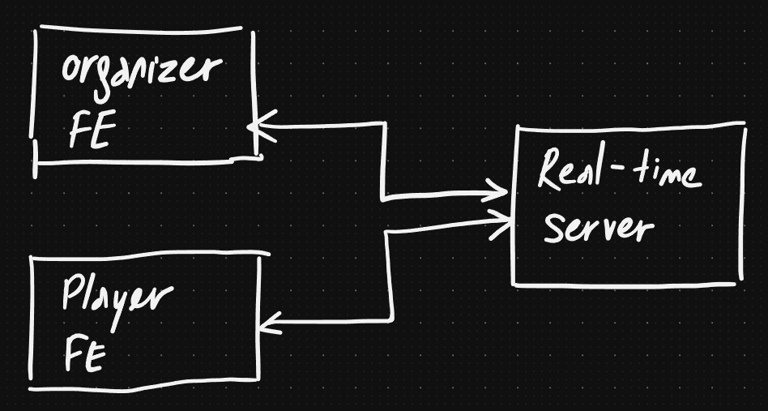
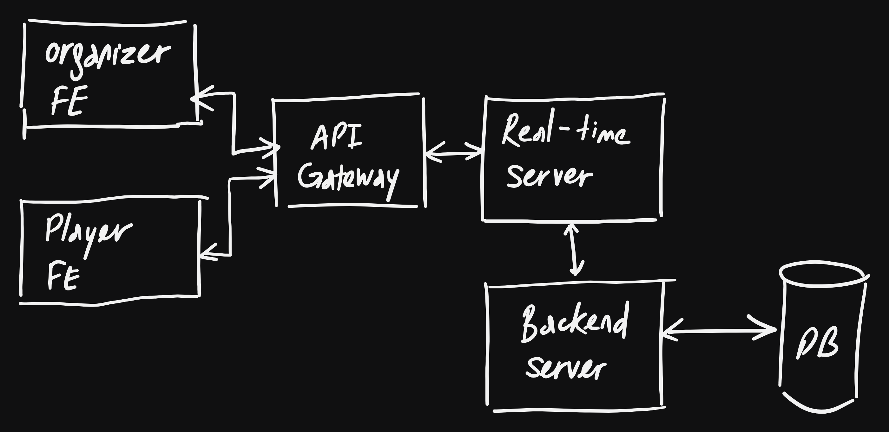
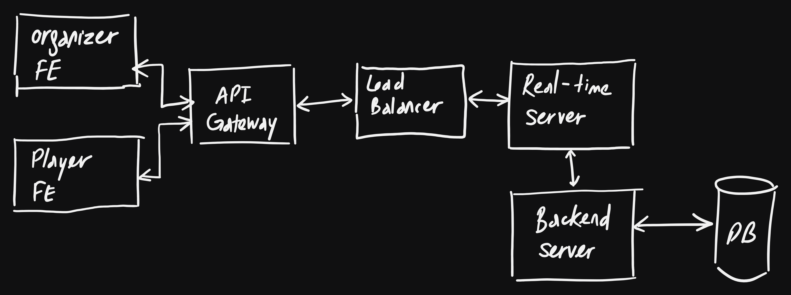

# System Design

The original requirements for the system can be found in the
[original requirements document](./original_requirements.md). There is a 
version 1 available [here](./system_design.md). However, I want to explore a 
better structure for the document, hence this version 2.

## Requirements

As I mentioned in the version 1 of this document, I think the end-result 
should be something similar to Kahoot's. For time reason, I will assume that 
there is only one type of game: quiz games with 4 possible answers. I will
ignore the data management part (CRUD), as I think it is not important for this
assignment. Authentication/authorization is also purposefully left out as well.

### Functional Requirements

There should be two types of users: the organizer and the player. They should be
able to do the following:

- Players can join a game and play (see the questions and answers and pick 
  one answer)
- Players can see the results/leaderboard
- Organizers can start/restart a game

### Non-functional Requirements

Because this is a game, where the end-user interact with the system through 
a game interface, I think apart from an intuitive and good UX, 
latency/responsiveness is the most important aspect. In implementing the
system, I will focus on the latency part, as I consider UI design not a 
strong suit of mine.

### Core Entities

As we have two types of users, there should be at least two types of entities:

- Player
- Organizer

Because the game is stateful, we would want to think about the game and its 
related data as well:

- Game
- Question
- Answer

### APIs

As we are focusing on the game/latency part, the API design is quite simple: 
one endpoint for each type of user.

- `/quizz`: real-time endpoint for players to join a game and play
- `/quizz/organizer`: real-time endpoint for organizers to manage the games

## High-level Design

At the simplest level, the system should have the following components:

- Organizer Frontend: the frontend that the organizer will use to manage the
  games.
- Player Frontend: the frontend that the players will use to play the games.
- Real-time Server: the server that manages the games and the players.

This simple version did not take into account the data management part (CRUD) of
questions and answers. Even if it is the focus of this assignment, I think 
we still need it to understand the whole system. Data management needs the 
database, and an API server (should be a "traditional" RESTful one as we 
have no special requirements for it). Let's call the API server "Backend 
Server". We don't have any special requirements for our data storage either, so
we can give it a generic name "Database". Another important part is the
authentication/authorization. As it's not the focus, we put an API Gateway 
before the system and assume that authentication/authorization is handled.

- Backend Server: the server that do data management.
- Database: the database that stores the questions and answers.
- API Gateway: a server/proxy that handles authentication/authorization.

Now, it's easily seen that real-time server can be a bottleneck: it receives 
and processes the data from the frontends, and then sends the results back. 
It also fetches the questions and answers from the backend, and depending on 
our implementation, do the score calculations. Vertical scaling can take us 
quite far, but we should also consider horizontal scaling. The intuitive 
thing to do is to spin up many identical real-time servers, and put them 
behind a load balancer.

## Deep Dives

As we mentioned the importance of latency, we should think about how to 
achieve it with the current design. Having low latency means we need to 
consider:

- Minimize the data transferring (I/O bound)
- Minimize the processing (CPU bound)

It is related to one choice that we should do now: how and where to calculate
the score. We can either do it in the real-time server, or we can do it in the
backend server. The trade-off is clear:

- Real-time server: gives us lower latency, but comes with a higher complexity
  as essentially, we are having two sources of data: the real-time server and
  the database itself. Scalability is also a small concern: as the real-time
  servers aren't identical right now, the load balancer will have to do some 
  specific work to distribute the load (sticky sessions).
- Backend server: gives us higher latency as the data would travel a long route
  before being returned to the frontends, but comes with a lower complexity.

Another potential problem is the writes that the frontends do: we would want to
store the answers in the database in case the real-time server crashes and we
have to rebuild the game state. The writes are quite frequent, and might 
overwhelm the database. There are two options to mitigate this:

- Use a queue to store the answers, and have another worker consume the queue.
- Batch the writes together (instead of updating that player 1 answered A 
  for question 1 and player 2 answered B for question 1, separately, we can 
  update both players' answers at once).

I would prefer the latter option because it wouldn't add more components to the
system and hence easier to implement and maintain. One downside is that in 
an edge case, where the writes are batched but not executed, we might lose some
data.
