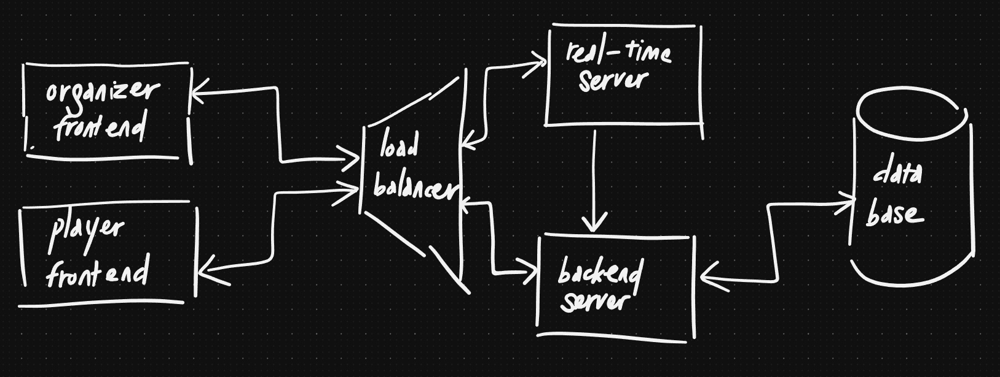

# System Design

The original requirements for the system can be found in the
[original requirements document](./original_requirements.md). There is a 
version 1 available [here](./system_design.md). However, I want to explore a 
better structure for the document, hence this version 2.

## Requirements

As I mentioned in the version 1 of this document, I think the end-result 
should be something similar to Kahoot's. For time reason, I will assume that 
there is only one type of game: quiz games with 4 possible answers.

### Functional Requirements

There should be two types of users: the organizer and the player. They should be
able to do the following:

- Players can join a game and play (see the questions and answers and pick 
  one answer)
- Players can see the results/leaderboard
- Organizers can start/restart a game

### Non-functional Requirements

Because this is a game, where the end-user interact with the system through 
a game interface, I think apart from an intuitive and good UX, 
latency/responsiveness is the most important aspect. In implementing the
system, I will focus on the latency part, as I consider UI design not a 
strong suit of mine.

### Core Entities

As we have two types of users, there should be at least two types of entities:

- Player
- Organizer

Because the game is stateful, we would want to think about the game and its 
related data as well:

- Game
- Question
- Answer

### APIs

As we are focusing on the game/latency part, I would not mention the data 
management (CRUD) APIs here. Authentication/authorization, despite their 
importance, is also purposefully left out as well.

- `/quizz`: real-time endpoint for players to join a game and play
- `/quizz/organizer`: real-time endpoint for organizers to manage the games

## High-level Design

I made a few drafts, but then went with this "basic" one:

- Organizer frontend: the frontend that the organizer will use to manage the
  games.

